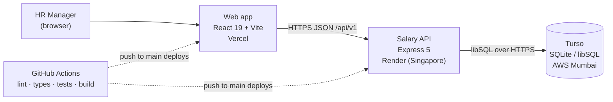
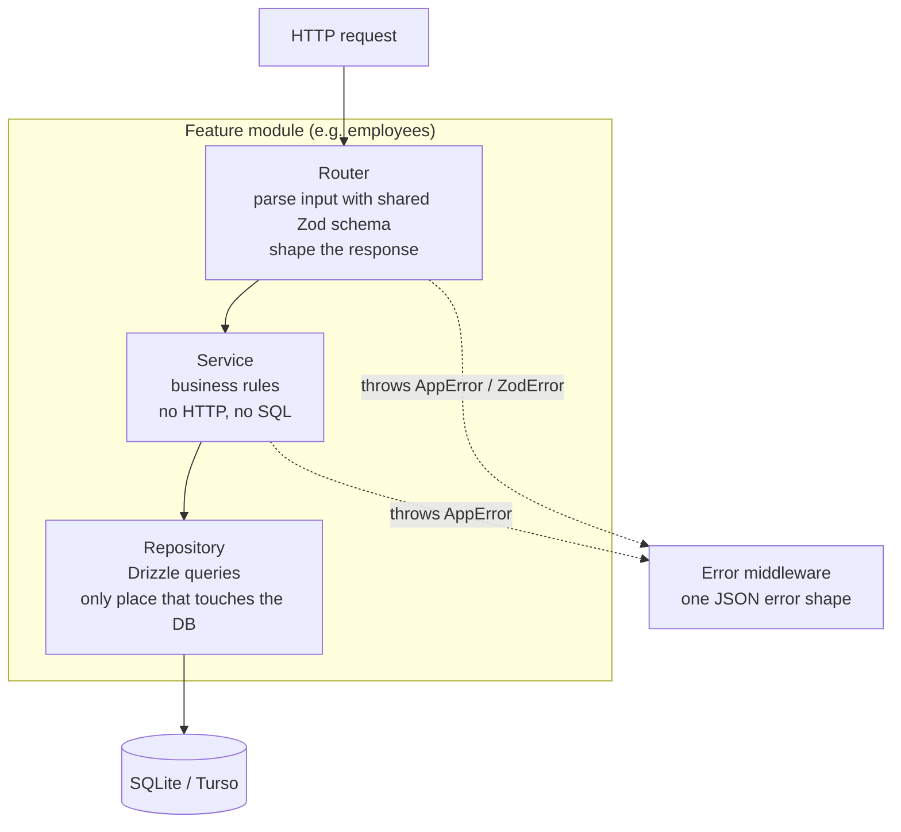
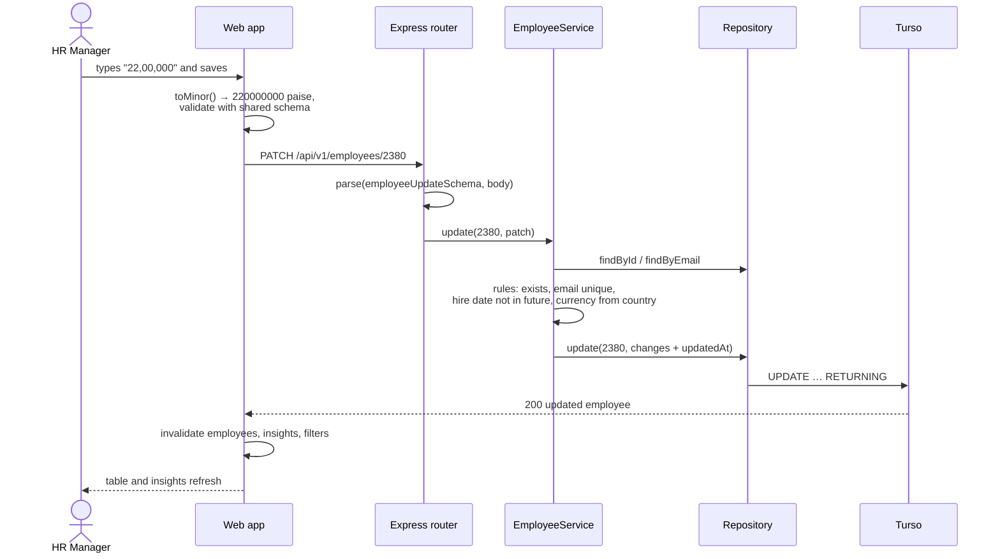
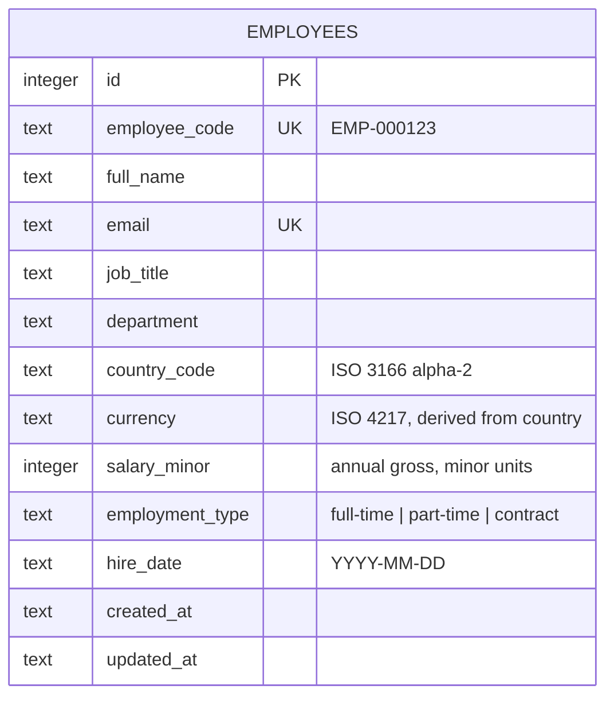
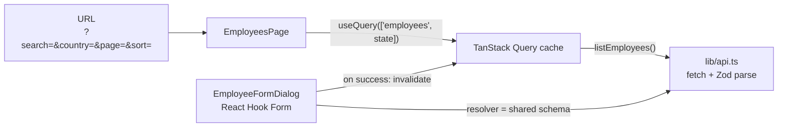
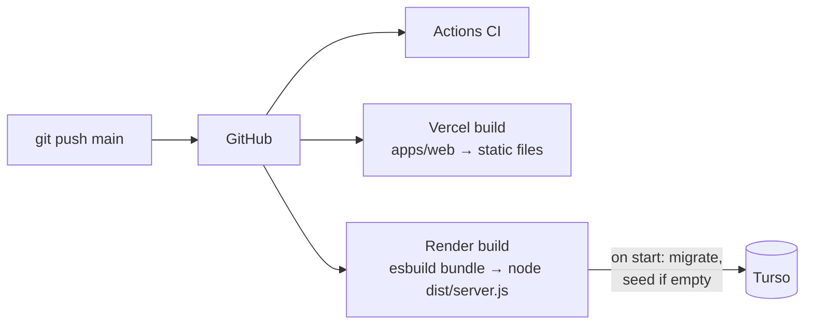

# Architecture

**In one line:** a React single-page app on Vercel calls an Express API on Render. The API keeps business rules in services, and only its repositories touch the database (SQLite via Turso). Both apps share one set of Zod schemas, so they can't disagree about the data.

## System context

## Repository layout

| Path                             | Owns                                                                                                                              |
| -------------------------------- | --------------------------------------------------------------------------------------------------------------------------------- |
| `packages/shared`                | Zod schemas and inferred types: employee input/update/output, list query, insights, errors, the 10 countries and their currencies |
| `apps/api/src/modules/<feature>` | One folder per feature: `*.router.ts` (HTTP), `*.service.ts` (rules), `*.repository.ts` (SQL), tests beside them                  |
| `apps/api/src/db`                | Drizzle table definition, client factory, migration runner; SQL migrations in `apps/api/drizzle/`                                 |
| `apps/api/src/seed`              | Seeded generator for 10,000 employees and the batched seeder                                                                      |
| `apps/web/src/features`          | `insights/` and `employees/` screens with their dialogs and tests                                                                 |
| `apps/web/src/lib`               | Typed API client, money/date formatters, small hooks                                                                              |
| `apps/web/src/components`        | Layout and UI primitives (shadcn-style, owned in the repo)                                                                        |

## API layers

| Layer      | May depend on                                 | Must not                  |
| ---------- | --------------------------------------------- | ------------------------- |
| Router     | service, `parse()` helper, shared schemas     | contain rules or SQL      |
| Service    | repository **interface**, clock, shared types | import Express or Drizzle |
| Repository | Drizzle, table schema                         | decide business outcomes  |

The service depends on an `EmployeeRepository` interface, not the Drizzle class. Unit tests pass an in-memory fake, and a PostgreSQL implementation could replace the SQLite one without touching the service ([ADR 0004](adr/0004-drizzle-orm.md)).

`createApp(deps)` builds the app from its dependencies (database, clock, CORS origin, version) and never calls `listen`. Tests drive it in-process with Supertest; `server.ts` is the only file that starts a server.

## Request flow: editing a salary

Failures take the same path back. The service throws `AppError(409, 'EMAIL_TAKEN')`, the error middleware turns it into `{ "error": { "code", "message" } }`, and the form puts the message on the email field.

## Data model

There is one table, on purpose. Countries and currencies are a fixed list in `packages/shared`, so both apps use it without a lookup query. Departments and job titles are free text, and their dropdown options come from `SELECT DISTINCT`. The roadmap's first schema additions are salary history (`salary_revisions`) and normalised departments.

Indexes follow the queries in [performance.md](performance.md): `(country_code, job_title)`, `(country_code, salary_minor)`, `department`, `job_title`, `full_name`, plus unique `email` and `employee_code`.

## How the insights are computed

All grouping runs in SQL; only one row per group reaches Node.

| Insight                                  | Query                                                                                                                                                                 |
| ---------------------------------------- | --------------------------------------------------------------------------------------------------------------------------------------------------------------------- |
| Min, max, average, headcount per country | `GROUP BY country_code, currency`                                                                                                                                     |
| Median per country                       | `ROW_NUMBER() OVER (PARTITION BY country_code ORDER BY salary_minor)` and `COUNT(*) OVER (…)`; keep the middle row (odd count) or average the middle two (even count) |
| Per job title within a country           | `WHERE country_code = ? GROUP BY job_title ORDER BY AVG(salary_minor) DESC`                                                                                           |
| Overview                                 | `COUNT(DISTINCT …)` plus headcount `GROUP BY department` and `employment_type`                                                                                        |

Amounts are never added across currencies ([ADR 0005](adr/0005-money-as-integers.md)). Every insight is per country, in that country's currency.

## Frontend

- **Server state** lives in TanStack Query. A mutation invalidates the `employees`, `overview`, `countries`, `job-titles` and `filters` queries, so insights stay correct after an edit.
- **List state** (search, filters, sort, page, page size) lives in the URL, so a filtered view can be bookmarked, shared or restored with the back button.
- **Form validation** uses the same `employeeInputSchema` as the API. The resolver first converts the typed salary text into integer minor units, without floats.
- **The API client** validates every response with the shared schema. A failure becomes an `ApiRequestError` carrying the API's `code` (or `NETWORK_ERROR` when the server is asleep).
- **Cold starts:** the layout polls `/health` every 5 s until the free Render instance wakes, and shows a banner meanwhile.

## Errors

| Situation                  | HTTP | `code`                                          | Where the user sees it       |
| -------------------------- | ---- | ----------------------------------------------- | ---------------------------- |
| Invalid body or query      | 400  | `VALIDATION_ERROR` + `details[{path, message}]` | On each field                |
| Malformed JSON             | 400  | `INVALID_JSON`                                  | Form banner                  |
| Hire date after today      | 400  | `HIRE_DATE_IN_FUTURE`                           | Hire date field              |
| Unknown employee           | 404  | `EMPLOYEE_NOT_FOUND`                            | Form or dialog error message |
| Email used by someone else | 409  | `EMAIL_TAKEN`                                   | Email field                  |
| Unknown route              | 404  | `NOT_FOUND`                                     | —                            |
| Anything unexpected        | 500  | `INTERNAL_ERROR` (details logged, not returned) | Error notice                 |

## Deployment

Details, environment variables and rollback: [deployment.md](deployment.md). Why these hosts: [ADR 0007](adr/0007-free-tier-hosting.md).

## Decisions

| ADR                                   | Decision                                           |
| ------------------------------------- | -------------------------------------------------- |
| [0001](adr/0001-pnpm-monorepo.md)     | pnpm monorepo with a shared schema package         |
| [0002](adr/0002-express-backend.md)   | Express 5 for the API                              |
| [0003](adr/0003-sqlite-turso.md)      | SQLite locally, Turso in production                |
| [0004](adr/0004-drizzle-orm.md)       | Drizzle ORM and migrations                         |
| [0005](adr/0005-money-as-integers.md) | Integer minor units, local currency, no conversion |
| [0006](adr/0006-no-auth-in-mvp.md)    | No authentication in the MVP                       |
| [0007](adr/0007-free-tier-hosting.md) | Vercel + Render + Turso free tiers                 |

## Where it would change next

1. **Auth and roles:** one Express middleware in front of `/api/v1`, plus a `user` in the service context for an audit log.
2. **CSV/Excel import:** a new `imports` module that reuses `employeeInputSchema` row by row and reports invalid rows.
3. **Salary history:** a `salary_revisions` table; `employees.salary_minor` becomes the latest revision.
4. **Scale:** PostgreSQL behind the same repository interface, keyset pagination, full-text search.
