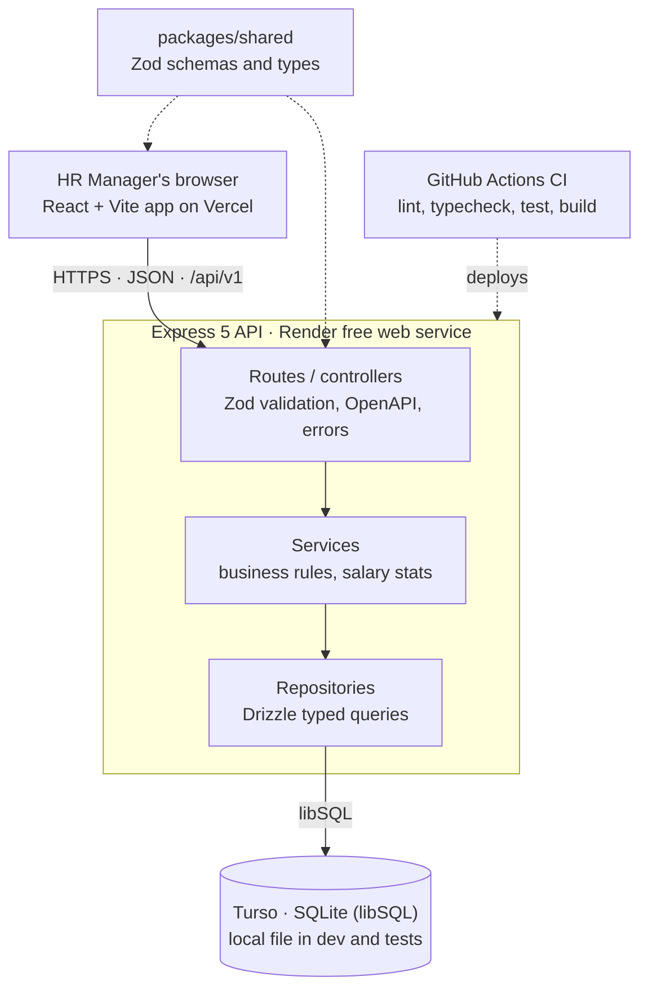

# Salary Management – Project Plan

Planning and design notes, written 1 Oct 2026 before any code. The living version of this plan was kept as a shared doc; this file is its committed snapshot.

## Goals and principles

Submit a lean, polished salary management MVP for ACME's HR Manager within 2 days. Product work starts only after the submission is sent.

- **Submission first:** on-time delivery beats extra features. Anything not needed for the brief waits until after submission.
- **Low-risk choices:** proven, familiar tools (Express, SQLite, React) over newer or heavier ones.
- **Assessment fit:** every feature answers the HR Manager's need to manage salary data and understand how the org pays people. Judgment over complexity.
- **Product-ready base:** clean layering and typed contracts, so the product phase builds on this code without a rewrite.
- **Visible craft:** test-first development, small commits that tell the story, and decisions recorded as ADRs.
- **Intentional AI use:** AI accelerates scaffolding, test ideas and docs; every AI output is reviewed and the workflow is documented.
- **Free tier now:** zero running cost for the assessment.

## Scope

The MVP covers two jobs: managing employee salary records, and answering how ACME pays people by country and role. Everything else is a documented non-goal or a roadmap item. See [requirements.md](./requirements.md) for the one-page version.

**MVP features (assessment)**

| Area | Feature | Why it matters to the HR Manager |
| --- | --- | --- |
| Employees | Paginated list of 10,000 employees with search (name/email), filters (country, job title, department) and sorting | Replaces scrolling an Excel sheet |
| Employees | Create, view, edit and delete an employee with validation | Core data management |
| Insights | Per country: headcount, min, max, average and median salary | "How do we pay people in India vs the US?" |
| Insights | Per job title within a country: headcount, average, min, max | "Are our engineers in Germany paid consistently?" |
| Insights | Org overview: total headcount, countries, departments, salary distribution chart per country | One-glance summary |
| Data | Deterministic, seeded script that generates 10,000 realistic employees in seconds | Required by the brief, repeatable demos |
| Platform | OpenAPI docs, health check, structured errors and logging | Product-ready base |

**Deliberate non-goals (with reasons)**

- **Authentication and roles:** single HR persona in the brief; adding auth costs time without proving the core. Designed so an auth layer slots in at the API boundary.
- **Currency conversion:** salaries stay in local currency and insights are grouped per country, so no exchange-rate source is needed and no numbers are misleading.
- **Net salary, tax and deductions:** country tax rules are a product of their own; gross salary only.
- **Salary history:** current salary only; schema keeps a clean path to a `salary_revisions` table.
- **Excel/CSV import and export:** high product value, but the seed script covers the brief. First roadmap item.

**Product roadmap (after the assessment)**

1. CSV/Excel import and export with validation report
2. Authentication, roles (HR admin, viewer) and audit log
3. Salary history with effective dates and revision approvals
4. Multi-currency normalisation with dated exchange rates
5. Salary bands, compa-ratio and pay-equity analytics
6. Multi-tenant organisations and PostgreSQL on a paid plan

## Tech stack

TypeScript end to end in a pnpm monorepo: an Express API on SQLite (libSQL), and a React + Vite frontend. One shared package carries the Zod schemas, so the API and UI can never disagree on types.

| Layer | Choice | Why this over the alternatives |
| --- | --- | --- |
| Language | TypeScript (strict), Node.js 22 LTS | The role's stack; strict mode catches errors before tests do |
| Monorepo | pnpm workspaces: `apps/api`, `apps/web`, `packages/shared` | One repo, one CI, shared contracts; lighter than Nx/Turborepo for 2 apps |
| Backend framework | **Express 5** | Lowest-risk choice: the most familiar Node framework, minimal setup, huge ecosystem, and v5 forwards async errors to the error handler natively. Layering comes from folder conventions (routes, services, repositories). NestJS's modules, DI and decorators add setup time a 2-day deadline can't afford |
| Validation and contracts | Zod + a small `validate()` middleware; `@asteasolutions/zod-to-openapi` + `swagger-ui-express` | One schema validates requests, types the code and generates the API docs |
| Database | SQLite via libSQL: local file in dev and tests, Turso in production | Follows the brief's SQLite suggestion, and Turso's free tier persists data where free hosts have ephemeral disks |
| ORM and migrations | Drizzle ORM + drizzle-kit | SQL-shaped, typed queries, versioned migration files; native libSQL support ([Drizzle + Turso](https://orm.drizzle.team/docs/tutorials/drizzle-with-turso)); also supports PostgreSQL for the product phase |
| Frontend | React 19 + Vite + React Router | Fast dev server and static build that deploys anywhere free |
| Server state | TanStack Query | Caching, loading and error states, invalidation after edits |
| Tables | TanStack Table (server-side pagination, sort, filter) | Handles 10,000 rows without sending them all to the browser |
| Component library | shadcn/ui (Radix + Tailwind CSS) | Accessible components you own in the repo; easy to theme into a product brand |
| Charts | Recharts | Simple, typed charts for salary distribution |
| Forms | React Hook Form + Zod resolver | Reuses the shared schemas for client validation |
| Testing | Vitest (API + web), Supertest, React Testing Library | Fast, deterministic unit and integration tests in one runner; Supertest is the standard for Express |
| Quality | ESLint, Prettier, Conventional Commits | Consistent code and readable history |
| CI | GitHub Actions: lint, typecheck, test, build on every push | Proves the build is green, free for public repos |

Database portability: queries live behind repository interfaces, so moving to PostgreSQL later means a new Drizzle schema and repository implementation, with services and tests unchanged.

## Architecture

A layered API (routes → services → repositories) keeps business rules free of HTTP and SQL, so they are unit-tested in milliseconds and survive a database or framework change.



**Repository layout**

```
salary-management/
├── apps/
│   ├── api/                 # Express 5 + Drizzle
│   │   ├── src/
│   │   │   ├── modules/
│   │   │   │   ├── employees/   # router, controller, service, repository, tests
│   │   │   │   └── insights/
│   │   │   ├── db/              # schema, client, migrations
│   │   │   ├── middleware/      # validate, error handler, request logging
│   │   │   ├── app.ts           # createApp() used by server and Supertest
│   │   │   └── server.ts        # app.listen()
│   │   └── scripts/seed.ts
│   └── web/                 # React + Vite
│       └── src/{features,components,lib,routes}
├── packages/shared/         # Zod schemas and types
├── docs/                    # guides, ADRs, diagrams
└── .github/workflows/ci.yml
```

**Data model (MVP)**

| Column | Type | Notes |
| --- | --- | --- |
| `id` | integer PK | Auto-increment |
| `employee_code` | text, unique | e.g. `EMP-000123` |
| `full_name` | text | Required, 2-100 chars |
| `email` | text, unique | Validated format |
| `job_title` | text, indexed | Required |
| `department` | text, indexed | Required |
| `country_code` | text (ISO 3166 alpha-2), indexed | Required |
| `currency` | text (ISO 4217) | Derived from country, stored for clarity |
| `salary_minor` | integer | Annual gross in minor units (paise, cents), avoids float errors |
| `employment_type` | text enum | full-time, part-time, contract |
| `hire_date` | text (ISO date) | Required, not in the future |
| `created_at`, `updated_at` | text (ISO timestamp) | Set by the app |

Composite index on (`country_code`, `job_title`) serves the job-title-in-country insight.

**API (v1)**

| Method | Path | Purpose |
| --- | --- | --- |
| GET | `/api/v1/employees?page&pageSize&search&country&jobTitle&department&sort` | Paginated, filtered list |
| GET | `/api/v1/employees/:id` | One employee |
| POST | `/api/v1/employees` | Create |
| PATCH | `/api/v1/employees/:id` | Partial update |
| DELETE | `/api/v1/employees/:id` | Delete |
| GET | `/api/v1/insights/overview` | Org totals |
| GET | `/api/v1/insights/countries` | Salary stats per country |
| GET | `/api/v1/insights/countries/:code/job-titles` | Stats per job title in a country |
| GET | `/api/v1/meta/filters` | Distinct countries, titles, departments for dropdowns |
| GET | `/health` | Liveness and DB check |

Errors follow one shape (`{ error: { code, message, details } }`); docs are served at `/docs` from the Zod schemas.

**Performance at 10,000 rows**

- Server-side pagination (default 25, max 100) so the browser never loads all rows.
- Aggregates computed in SQL (`GROUP BY` with indexes); median computed with a window query per country.
- Seed inserts in batches of 500 inside one transaction, target under 5 seconds.
- Search debounced in the UI (300 ms); TanStack Query caches filter dropdowns.
- A benchmark test asserts list and insight endpoints answer under 200 ms on 10,000 rows locally.

## Engineering practices

Every feature is built test-first, in small commits, with CI green before the next step. The git log should read as the story of the build.

**Testing strategy**

| Level | What it covers | Tooling | Speed target |
| --- | --- | --- | --- |
| Unit | Services and pure functions: validation rules, salary stats (min/max/avg/median), currency formatting, seed generator | Vitest with in-memory fakes | Whole suite under 2 s |
| Integration | API routes against a fresh in-memory SQLite per test file: status codes, filters, pagination, error shape | Vitest + Supertest | Under 10 s |
| Component | Employee table, form validation, insight cards | Vitest + React Testing Library + MSW | Under 10 s |
| End-to-end | Add an employee; view country insights | Playwright | After submission (product phase) |

Tests stay deterministic: seeded random data, a fixed clock, no network and a fresh database per test file.

**TDD loop and commits**

1. Write a failing test named for the behaviour (`returns median salary for an even number of employees`).
2. Make it pass with the simplest code.
3. Refactor with tests green.
4. Commit using Conventional Commits: `test:` for the red step, `feat:` for green, `refactor:` for clean-up.

**Commit rules (reviewers read the history)**

- The first commits are docs only: `docs/requirements.md` and `docs/plan.md` land before any application code, proving the thinking came first.
- One behaviour per commit, each one building and passing tests; never a single "initial commit" dump.
- No squash or force-push on `main`, so the red, green and refactor steps stay visible.

**Branching and CI**

- `main` stays deployable; short feature branches merged by pull request with a short description, even when working solo.
- GitHub Actions runs lint, typecheck, unit, integration and build on every push; the build must be green before every merge.

**AI workflow**

- `CLAUDE.md` / `AGENTS.md` at the root holds the architecture rules, commands, conventions and the "tests first" rule for AI agents.
- AI is used for scaffolding, test-case brainstorming, seed data realism, docs drafting and review passes. Domain rules, schema and API design are decided by the engineer and recorded as ADRs.
- Every AI-generated change is read, run and tested before commit. Significant prompts and what was kept or rejected go into `docs/ai-usage.md`.

## Documentation set

The submission ships the 10 docs the brief asks for; interview notes follow before the technical rounds, and the 4 product guides after submission.

| File | Reader | Contents | When |
| --- | --- | --- | --- |
| `README.md` | Reviewer, anyone new | What it is, live demo link, video link, 5-minute quick start, doc index | Submission |
| `docs/requirements.md` | Reviewer, product owner | One page: goal, persona, scope, features, non-goals with reasons, assumptions | Submission (first commit) |
| `docs/plan.md` | Reviewer | This plan: planning and design notes, timeline, risks | Submission (first commit) |
| `docs/architecture.md` | Engineers | Context and container diagrams (Mermaid), layers, request flow, key decisions | Submission |
| `docs/adr/0001-*.md` ... | Engineers | One record per decision: Express, SQLite/Turso, Drizzle, monorepo, money as integers, no auth in MVP | Submission |
| `docs/testing.md` | Reviewer, contributors | Test pyramid, how to run, fixtures, determinism rules | Submission |
| `docs/deployment.md` | Reviewer, ops | Env vars, Turso + Render + Vercel steps, cold-start note | Submission |
| `docs/performance.md` | Reviewer | Indexes, query approach, benchmark numbers at 10,000 rows | Submission |
| `docs/ai-usage.md` + `CLAUDE.md` | Reviewer | AI tools used, agent instructions, key prompts, what was accepted or rejected and why | Submission |
| `/docs` (Swagger UI) | Reviewer, integrators | Generated from the Zod schemas, no extra writing | Submission |
| `docs/interview-notes.md` | Engineer | Walkthrough script: design decisions, architecture, AI workflow, trade-offs, possible improvements | Before interviews |
| `docs/development-guide.md` | Contributors | Setup, scripts, conventions, adding a module, coding standards | After submission |
| `docs/database-guide.md` | Engineers | ER diagram, migrations workflow, backups, Postgres migration path | After submission |
| `docs/api.md` | Integrators | Examples, error codes, pagination contract | After submission |
| `docs/user-guide.md` | HR Manager | Screens with screenshots: manage employees, read insights | After submission |

## Deployment (free tier)

Frontend on Vercel, API on Render's free web service, data in Turso. Total cost: $0. Render's free disk is wiped on every restart, so the SQLite file cannot live there; Turso keeps the same SQLite (libSQL) database hosted and persistent.

| Part | Service and plan | Free limits that matter | Upgrade path |
| --- | --- | --- | --- |
| Web (static React build) | Vercel Hobby | Global CDN, preview deploys per PR; Hobby is for non-commercial use | Vercel Pro, or Cloudflare Pages |
| API (Express) | [Render free web service](https://render.com/docs/free) | 750 instance hours/month; spins down after 15 minutes idle; cold start about 1 minute; ephemeral filesystem, no persistent disk | Render Starter (always on) |
| Database | [Turso free plan](https://turso.tech/pricing) | 5 GB storage, 500M rows read and 10M rows written per month, 1-day point-in-time restore | Turso Developer from $4.99/month, or PostgreSQL |
| CI | GitHub Actions | Free for public repositories | Same |

Ruled out: Fly.io and Koyeb no longer offer free plans to new users, and Railway's free trial expires after 30 days ([comparison](https://agentdeals.dev/hosting-free-tier-comparison-2026)).

**Cold start handling:** the UI shows a "waking up the server" state while `/health` responds, and the README tells reviewers to expect a slow first request.

## 2-day timeline

Deploying on the first morning removes the riskiest unknown early; each half-day ends at a gate that must pass before the next phase starts.

| Phase | Work | Gate |
| --- | --- | --- |
| Day 1 · morning — Foundation | Requirements doc and plan committed first; monorepo, lint, CI, CLAUDE.md; Turso DB, Render API and Vercel web deployed as hello world | Pipeline deploys end to end |
| Day 1 · afternoon — Backend, test-first | Drizzle schema, migrations, seed of 10,000 employees under 5 s; employees CRUD with validation, filters and pagination; insights per country and per job title; OpenAPI at `/docs` | API complete, integration tests green |
| Day 2 · morning — Frontend | App shell, employee table with search, filters and sort; create/edit form on shared Zod schemas; delete with confirm; insights dashboard with charts; component tests | Feature complete in production |
| Day 2 · afternoon — Harden and ship | Manual smoke test in production; performance benchmark check; submission docs; demo video; final README; reply in the same email thread | Submitted |

If a phase overruns, cut chart polish first; tests, the seed, deployment and the required docs stay. Submission is the hard deadline: nothing from the product phase starts before it.

**Submission checklist**

- [ ] Repository is public (or reviewers have access); open the link in a private window to confirm
- [ ] Live app and API `/health` respond; demo video link works without sign-in
- [ ] README links to the live app, video and every doc
- [ ] All brief artifacts present: requirements, plan, architecture diagrams, AI prompts, trade-offs, performance
- [ ] CI is green on `main`; seed runs from a clean clone
- [ ] Reply in the same email thread with the repository link

**After submission (product phase, Day 3 onward):** development, database, API and user guides; Playwright end-to-end tests; then the roadmap items in Scope, starting with CSV/Excel import.

## Risks and assumptions

The biggest risk is scope creep against a 2-day deadline; the fallback is to cut polish, never tests or docs.

| Risk | Impact | Mitigation |
| --- | --- | --- |
| Scope creep from the product vision | Late submission | Roadmap items stay in docs only; MVP list is frozen after Day 1 morning |
| Render cold start during review | Reviewer sees a slow first load | Waking-up UI state, README note, video demo as backup |
| Turso or Render setup issues | Deployment slips | Deploy a "hello world" on Day 1, not Day 2 |
| Median query cost on SQLite | Slow insights | Index plus window query; benchmark test guards it |
| HR team answers differ from assumptions | Rework | Assumptions isolated (currency, gross, auth) and listed in the requirements doc; adjust if a reply arrives |

**Assumptions in force (from the clarification email, no reply yet)**

- Current salary only, no history.
- Salaries stored in local currency; insights grouped per country, no conversion.
- Gross annual salary only, no tax or deductions.
- No authentication for the single HR Manager persona.
- SQLite is acceptable in production (via Turso).

**Sources:** [Render free tier docs](https://render.com/docs/free) · [Turso pricing](https://turso.tech/pricing) · [Hosting free tier comparison 2026](https://agentdeals.dev/hosting-free-tier-comparison-2026) · [Drizzle with Turso](https://orm.drizzle.team/docs/tutorials/drizzle-with-turso)
